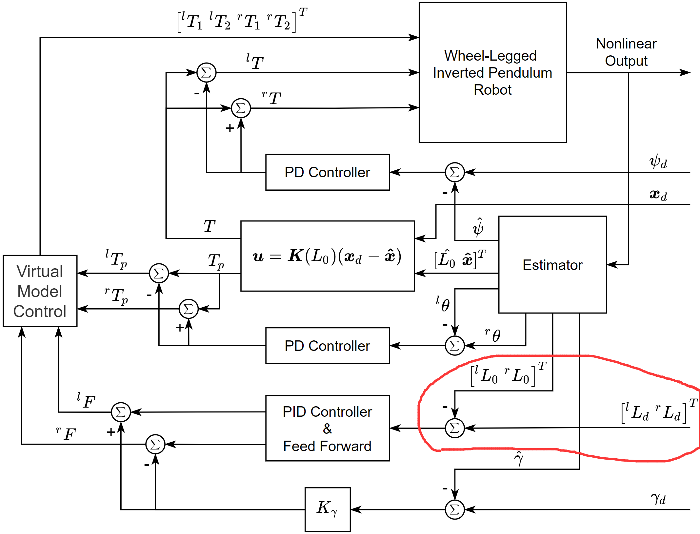
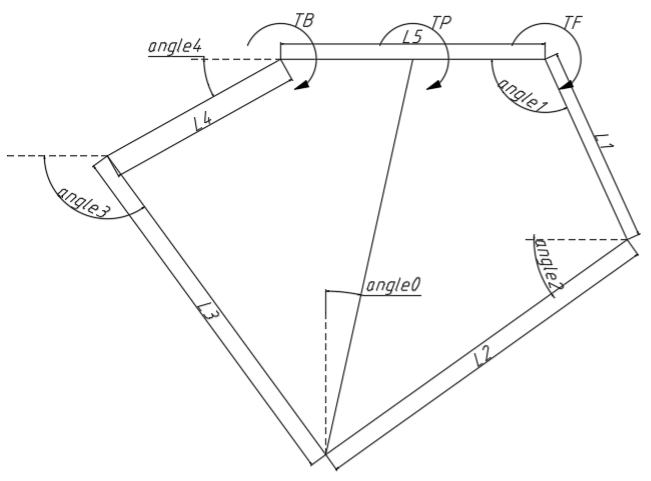

# wheelfoot code

## 通讯

### 下层通讯

can1 作为关节电机 **Tmotor** 的通讯

can2 作为足端轮子电机 **DJmotor** 的通讯

### 上层通讯
  
usart1 作为通讯的接口，使用蓝牙通讯

可以使用摇杆来控制速度，松手之后速度立即置零

打算是利用unity来做上位机，并且用游戏手柄做比赛的控制器，先试一试吧

每次发送的数据不能太多，要分开发，所以可以分别发送多种类型的参数，其中用 id 来判断信号类型

#### 规定

|0-1| 2 |3-n|n+1-n+2|
|---|---|---|-------|
|head|id|data|tail|

- head: 0xff 0xfe
- id:
  - 1 控制参数 ControlParam
  - 2 摇杆数据 HandleParam
  - 3 机器人状态参数 RobotState
  - 4
- data: 利用memcpy来实现复制
- tail: 0x0a 0x0d

## 控制

### 腿部的控制

设定从右侧看机器人为正视角，并且以向右为机器人正方向

所以右方向的腿被认为是正方向的腿，右侧的腿与右侧的腿完全对称就可以直接反过来了，所以只需要一个方向就可以直接规定所有不一致的方向了，所以对于设置电机的力矩之类的，都需要乘以一个方向值了

#### 规定

- angle1为前方电机的角度
- angle4为后方电机的角度
- TF 即为前部电机的力矩，对应于angle1
- TB 即为前部电机的力矩，对应于angle4
- Tp 为关节处扭矩，是一个虚拟出来的力，定义逆时针为正
- 一般会把 angle1 初始化为180度，也就是在angle=180的地方作为零点，同样以 angle4 初始化为0度

### 电机控制

电机的正方向是可以人为改变的，我这里打算把电机的正方向设置成一致的，也就是正向轴端逆时针为正（但是实际上我做成了正向轴端顺时针为正），这样对于解算来说，角度的正方向与电机的正方向一致，直接位控的话很方便，但是肯定不做位控()。电机最后只需要腿部的方向作为控制的方向了，对于需要反向的电机，需要在初始化的时候就设置反向

实际上，由于条件限制，电机正方向是逆时针为负，所以对于右侧电机，角度变化是负的，对于左侧电机，角度变化就是正的了

- **DJmotor**: 因为是通过PID来对输入进行解算的，所以只需要把输入做一个反向就好了，后面的输出都会是反向的

  id号规定
  - 0 右侧轮子电机
  - 1 左侧轮子电机

- **Tmotor**: 数据直接作用于电机，所以输出的正负直接影响电机的表现

  id号规定
  - 右前 1
  - 右后 2
  - 左前 3
  - 左后 4

### 机体控制

- lqr 控制器，很经典，但是控制上也会有很多缺陷，例如响应不够迅速，而且有些情况下就不适合使用了(腾空状态)，但是可以腾空之后只控制腿部的位姿
- 腾空检测 对地支持力的检测
- 机器人初始化的时候腿部需要一个限位块来确定电机的初始位置
- adrc 之后研究一下

### 跳跃控制

分相位来控制，相当于一个跳跃分为多个阶段来实现

- 跳跃1阶段——蹬地 kick
- 跳跃2阶段——收腿 shrink
- 空中姿态LQR平衡——依靠lqr来保持机体腿部竖直
- 缓冲——依靠腿长PID做一个阻尼控制来缓冲

## 参考

- [RoboMaster平衡步兵机器人控制系统设计](https://zhuanlan.zhihu.com/p/563048952)
- [RoboMaster平衡步兵机器人控制系统设计视频](https://www.bilibili.com/video/BV15W4y1i7Sf/?spm_id_from=333.337.search-card.all.click&vd_source=51da4e9c6aef240de92028196d31f7e6)
- [Balance Control of a Novel Wheel-legged Robot: Design and Experiments](https://www.researchgate.net/publication/355430284_Balance_Control_of_a_Novel_Wheel-legged_Robot_Design_and_Experiments)
- [A Two-Wheeled Jumping Robot](https://www.researchgate.net/publication/335144663_Ascento_A_Two-Wheeled_Jumping_Robot)

# 注意事项

## C语言结构体中数据的对齐

### 对齐方式

会以结构体中最大的数据类型来进行对齐，会造成内存的浪费

### 规定

- 使用 `#pragma pack(n)` 来进行定义，但是会导致使用内存读取速度降低
- 或者定义的时候要注意，将小的数据类型放在前面

## 踩过的坑——希望看到的人别踩到了😱

### 代码的优化等级需要注意

- 优化等级一般选用 -O0，如果使用较高的优化等级 (-O2) 会导致调试的时候出问题，而且代码的执行顺序也不一定按照自己的需求来，也就是说代码怎么运行的只有上帝才知道了。。。。
- 优化等级可能会导致板子下不进去代码，一定记得改好优化等级，建议 -O0，你要是nb也可以试试 -O2，毕竟可以优化代码运行效率

### 代码上的一些问题

- can消息定义一定不要忘记，要把所有该定义的的全部定义完成，有可能导致CAN消息的id号错误和消息错误(这很致命)
- 对于pid的计算，一定要注意，每次运行只进行一次运算，多次运算会导致一些问题
- M3508电机控制频率问题，频率太低控制不是很好
- 对于电机该使用的参数一定要写对，还有三角函数的计算使用的是弧度制
- 对于一些状态量的更新，一次运行只做一次就行，多写会出问题，会造成一些较大的抖动
- 对于腿长的控制，需要两条腿分别控制，一定不能用平均值
- 代码运行频率要做好，也可以做一些状态的预估值来做辅助解算
- 代码中对于 arctan 量的解算要使用 atan2，由于 atan 中形参分母为0是会直接跑死的，但是 atan2 与 atan 的解算结果的范围是不一样的，这一点需要注意

### 代码运行速率的优化

- 注意尽量写代码时规划好，别在同一时刻重复去做一件事
- 对于整数的乘法，尽量使用移位运算代替，减少运行消耗的时间
- 尽量别使用 `if-else if-else`，使用 `switch`
- 尽量使用移位操作来代替乘法，除法（仅限于整数）

### 控制上的一些问题

- 如果解算频率太快会导致收不到电机反馈而无法做出正确的解算，特别是力控这样，会导致很严重的抖动（滞后控制）

# README

写代码前提前规划好所有要写的和一些代码中需要的规定是个人习惯，并且在写代码的时候严格按照readme里面规定的架构来写，主要还是因为本人比较菜，又需要保证代码的结构和质量 T_T

这套代码里有之前写的模板类，所以感觉还是挺不错的，但是就是很难去debug，所以我是提前把功能调好了之后才把这段代码复制过来的，但是使用的时候要注意，并且记得在头文件里声明需要露出来的接口（感觉这点又有点繁琐，但是能够隐藏接口还是感觉挺不错的）。并且写这些模板类或者模板函数很好的一点就是能够减少很多重复的实现，使代码看起来更简洁（前提是写的没有bug）

对于这个系统，一定要在仿真里多跑一跑，把需要上车的代码多去验证一下，会发现并且解决很多在实物上不容易发现并且解决的问题

代码更新中.....

# 调试PLAN

## 基础功能

- [x] 腿长PID
- [x] splitpid
- [ ] 下地平衡
- [ ] rollpid 对于这个pid，总感觉控制量应当是腿长，而不是力矩呢，因为如果是力矩就会和腿长PID叠加，然后导致机体roll并不能适应环境
- [ ] yawpid

## 进阶功能

- [x] 离地检测
- [ ] 跳跃

# 调试寄录

## 调试流程

L0PID->splitpid->下地调节平衡->rollpid->yawpid

## 12.4

第一次上车，连腿子都没搞好，寄😭

## 12.5

下午调试，很有问题，还是之前的问题，还好我坚定代码流程没问题，最后是电机的底层代码写的有问题，蓝瘦。。。。。。改完就没问题了，就剩下调节PID了，nice! 一定要经常使用示波器来查看状态，很有用

## 12.6

调试PID有了一点成果，但是也发现系统有个非常致命的问题，就是当angle4角度>90°时，解算出的力矩竟然是向内的，这会加剧这种影响

控制腿长的PID终于调好了，总结一下调节PID的流程

- 先调P，有些系统里只给P的话会有震荡，主要还是系统本身自带的D和一些惯性的影响，有点震荡很正常，可以适当的给到超调（如果系统允许的话）
- 再调D，给一个比较好的阻尼系数，让系统减少震荡次数，可以不用给太大，有点震荡还好，特别是对于腿长的控制，要做缓冲，要有点弹簧系统的感觉
- 再调I：由于只有PD的话，会有稳态误差，给一个I可以减小稳态误差，要注意I是累积量，影响会很大，可以适当给小一点ki，如果出现高频震荡，可以适当减小一点I，或者增大一点D
- 调节这些系数都是要从小开始，一下给太会造成一些意料之外的状况

## 12.11

轮足对腿长的PID控制应当是两条腿分开控制的，但是我直接使用平均值，属于是纯纯的傻蛋了T_T

调节split_pid

## 12.13

把代码放进仿真里跑了跑，发现了抖动的问题，太剧烈了，研究了一上午才发现，原来是状态量更新做了两次 T_T，受不鸟了....改了之后发现在仿真里跑的很好，看来代码整体上是没问题的.

解决了腾空检测的一点点小问题，关于虚拟力方向的问题

## 12.19

调试过程中经常出现抖动，我怀疑是机器人的零点的问题，就是所认为的零点并不是真实的零点，再加上腿比较重，所以当腿部 `angle0=0` 时， `Tp=0`，但是机器人腿并不在一个平衡的位置，也就是这时候所需的 `Tp` 并不为0，导致抖动。

问题发现原因：这个代码在仿真里做的很好，但是在实物上很差，而且之前的调试中发现腿部所平衡的位置并不位于机器人的正下方

## 12.21

发现抖动的原因，应该是电机反馈跟不上解算的速度吧，但是实际上解算是10ms一次，按理说电机应该能够接到反馈的，感觉很离谱

## 12.22

把代码移植到我的仿真里面之后，成功的运行了，也就改了反馈频率的问题，看来对于力控来说，及时反馈是十分重要的

## 12.23

解决了抖动的问题，原来是电机的控制频率的问题？反正我把每次发送can消息数量变成了原来的两倍，也就是一次发送两条消息，然后就解决了？？我认为应该是电机反馈频率没跟上，也就是没来得及更新电机状态，导致的滞后控制

抖动问题解决之后一切进度就可以加速进行了😊

oh!!!!!! 终于两条腿都稳定了，看来明天下地有望！！！！

## 12.24

又出现了抖动的问题，终于找到了原因，原来是控制频率太低了，把控制频率改高就好了，基本上解决了抖动的问题

md，站不起来，令人痛苦，在仿真中 `l0pid` 和 `splitpid` 调节好之后就能成功站起来了，但是实物却没站起来，一时间竟不知该怎么搞了，蓝瘦