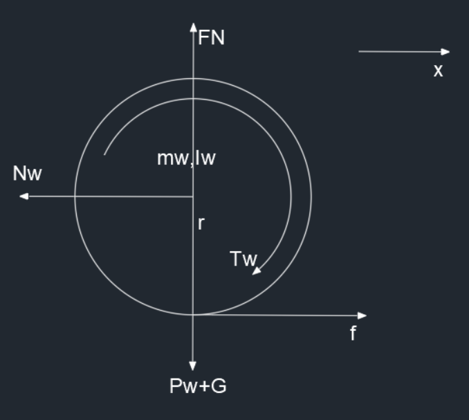
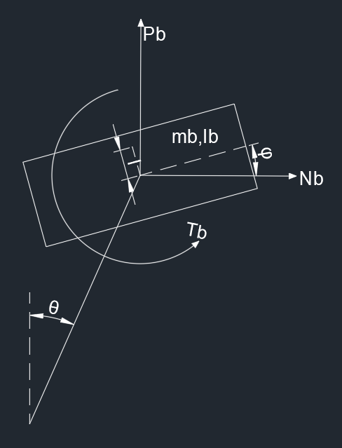
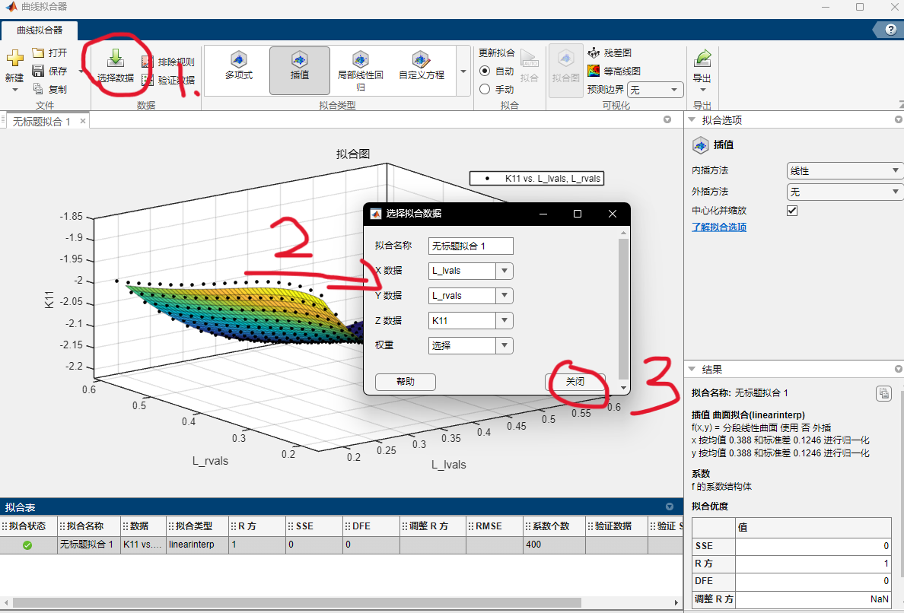
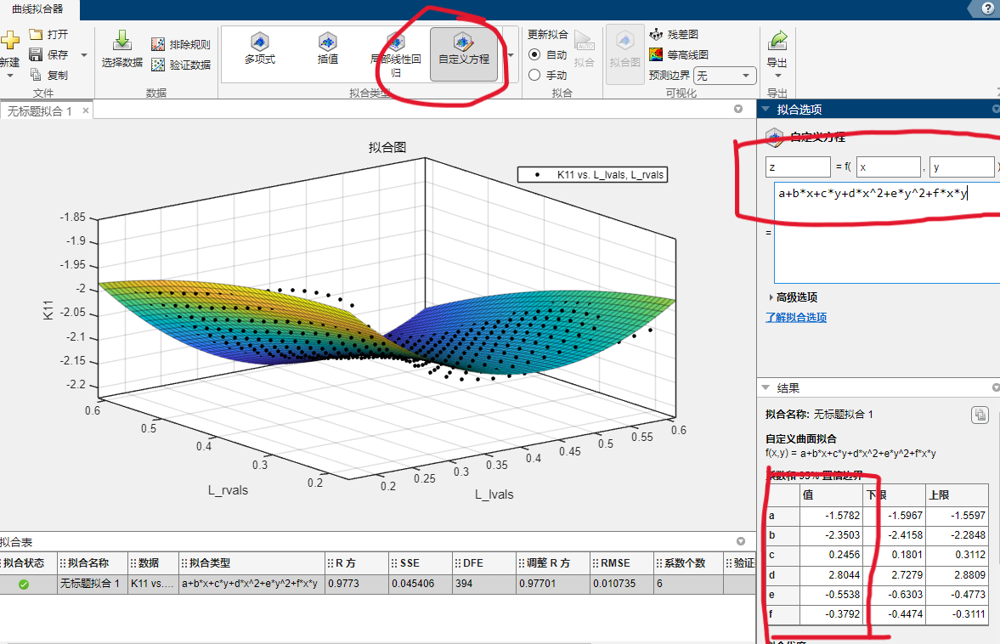

# 双足轮式机器人分析

# 单侧系统状态方程求解

首先双轮足式机器人可以将模型化简为一个倒立摆模型，如下


分块开始分析

## **轮子**



水平方向上

$$
m_w\ddot{x}=f-N_w
$$

竖直方向上

$$
F_N=P_w+G
$$

转矩

$$
I_w\frac{\ddot{x}}{r}=T_w-fr
$$

联立消去 $f$ 得到

$$
\ddot{x}=\frac{T_wr-N_wr^2}{I_w+m_wr^2}~~~~\textcircled{1}
$$

## **摆杆**


水平方向上

$$
m_l(\ddot{x}+\frac{\partial^2}{\partial t^2}L_w\sin\theta)=N_w-N_b~~~~\textcircled{2}
$$

竖直方向上

$$
m_l\frac{\partial^2}{\partial t^2}L_w\cos\theta=P_w-P_b-m_lg~~~~\textcircled{3}
$$

转矩

$$
I_l\ddot{\theta}=T_b-T_w+(P_bL_b+P_wL_w)\sin\theta-(N_bL_b+N_wL_w)\cos\theta~~~~\textcircled{4}
$$

## **机体**



水平方向上

$$
m_b(\ddot{x}+\frac{\partial^2}{\partial t^2}L\sin\theta-\frac{\partial^2}{\partial t^2}l\sin\varphi)=N_b~~~~\textcircled{5}
$$

竖直方向上

$$
m_b(\frac{\partial^2}{\partial t^2}L\cos\theta+\frac{\partial^2}{\partial t^2}l\cos\varphi)=P_b-m_bg~~~~\textcircled{6}
$$

转矩

$$
I_b\ddot{\varphi}=T_b+N_bl\cos\varphi+P_bl\sin\varphi~~~~\textcircled{7}
$$

根据上述得到的 $\textcircled{2}\textcircled{3}\textcircled{5}\textcircled{6}$ 联立，得到中间变量 $P_w,N_w,P_b,N_b$ 的表达式，得

$$
\left\{\begin{aligned}&P_w=m_b(\frac{\partial^2}{\partial t^2}L\cos\theta+\frac{\partial^2}{\partial t^2}l\cos\varphi)+m_bg+m_l\frac{\partial^2}{\partial t^2}L_w\cos\theta+m_lg\\&N_w=m_l(\ddot{x}+\frac{\partial^2}{\partial t^2}L_w\sin\theta)+m_b(\ddot{x}+\frac{\partial^2}{\partial t^2}L\sin\theta-\frac{\partial^2}{\partial t^2}l\sin\varphi)\\&P_b=m_b(\frac{\partial^2}{\partial t^2}L\cos\theta+\frac{\partial^2}{\partial t^2}l\cos\varphi)+m_bg\\&N_b=m_b(\ddot{x}+\frac{\partial^2}{\partial t^2}L\sin\theta-\frac{\partial^2}{\partial t^2}l\sin\varphi)\end{aligned}\right.
$$

带入 $\textcircled{1}\textcircled{4}\textcircled{7}$ 中，并且利用 matlab 的符号求解工具解。

设定

$$
X=\begin{bmatrix}x\\\dot{x}\\\theta\\\dot{\theta}\\\varphi\\\dot\varphi\end{bmatrix}\\U=\begin{bmatrix}Tw\\Tb\end{bmatrix}
$$

最终求解对应的雅各比矩阵，就是 A 和 B

```matlab
clc
clear

syms x(t) theta(t) phi(t)
syms mw Iw Lw Lb L ml Il Tw Tb mb Ib l r g
syms x_ddot theta_ddot phi_ddot x_dot theta_dot phi_dot

Pw = mb * diff(diff(L * cos(theta) + l * cos(phi), t), t) + mb * g + ml * Lw * diff(diff(cos(theta), t), t) + ml * g;
Nw = ml * diff(diff(x + Lw * sin(theta), t), t) + mb * diff(diff(x + L * sin(theta) - l * sin(phi), t), t);
Pb = mb * diff(diff(L * cos(theta) + l * cos(phi), t), t) + mb * g;
Nb = mb * diff(diff(x + L * sin(theta) - l * sin(phi), t), t);

funcs = [x_ddot == (Tw * r - Nw * r * r) / (Iw + mw * r * r);
         Il * theta_ddot == Tb - Tw + (Pb * Lb + Pw * Lw) * sin(theta) - (Nb * Lb + Nw * Lw) * cos(theta);
         Ib * phi_ddot == Tb  + Nb * l * cos(phi) + Pb * l * sin(phi)];

funcs = subs(funcs, ...
            [diff(x, t), diff(theta, t), diff(phi, t), diff(diff(x, t), t), diff(diff(theta, t), t), diff(diff(phi, t), t)], ...
            [x_dot, theta_dot, phi_dot, x_ddot, theta_ddot, phi_ddot]);

[x_ddot, theta_ddot, phi_ddot] = solve(funcs, [x_ddot theta_ddot phi_ddot]);

X = [x, x_dot, theta, theta_dot, phi, phi_dot];
U = [Tw Tb];
X_dot = [x_dot, x_ddot, theta_dot, theta_ddot, phi_dot, phi_ddot];
A = jacobian(X_dot, X);
B = jacobian(X_dot, U);
A = subs(A, [x_dot, theta(t), theta_dot, phi(t), phi_dot, Tw, Tb], zeros(1,7));
B = subs(B, [x_dot, theta(t), theta_dot, phi(t), phi_dot, Tw, Tb], zeros(1,7));
```

最终得到结果

$$
A=\begin{bmatrix}0&1&0&0&0&0\\0&0&0&0&0&0\\0&0&0&1&0&0\\0&0&\frac{L_bm_bg+L_wm_bg+L_wm_lg}{I_l}&0&0&0\\0&0&0&0&0&1\\0&0&0&0&\frac{lm_bg}{I_b}&0\end{bmatrix}\\B=\begin{bmatrix}0&0\\\frac{r}{m_wr^2+Iw}&0\\0&0\\-\frac{1}{I_l}&\frac{1}{I_l}\\0&0\\0&\frac{1}{I_b}\\\end{bmatrix}
$$

这就是系统状态空间方程

# 控制器设计

## LQR 控制器

首先是 LQR 控制器。是一个比较常用的控制器，设计起来也比较简单。

推导过程与一般的 LQR 无异，所以直接调用 matlab 函数来求得对应的 K，最终需要拟合出一个 K 关于杆长的函数

```matlab
%% 设置
C = eye(6);
D = zeros(6,2);
Q = diag([100 100 100 10 5000 1]);
R = diag([1 0.25]);
sys = ss(A, B, C, D);
KLQR = lqr(sys, Q, R);%得到反馈增益矩阵
```

其中的 Q 和 R 就是系统状态与系统输入的权重，越大表示越在意

最终需要将控制器反馈增益矩阵拟合为关于杆长的一元三次方程，具体的拟合代码为

```matlab
% 拟合质心位置，转动惯量和杆长的函数
I = zeros(1, 90);
L = zeros(1, 90);
Lw = zeros(1, 90);
Lb = zeros(1, 90);

for angle4 = 0 : 1 : 89
    [ml, Il, L_, Lw_, Lb_] = GetLegBaryCenter(180 - angle4, angle4, 0);
    I(angle4 + 1) = Il;
    L(angle4 + 1) = L_;
    Lw(angle4 + 1) = Lw_;
    Lb(angle4 + 1) = Lb_;
end

KI = polyfit(L, I, 1);
valKI = polyval(KI,L);
figure(1);hold on;plot(L,I,'r*',L,valKI,'b-.');

KLw = polyfit(L, Lw, 1);
valKLw = polyval(KLw,L);
figure(1);hold on;plot(L,Lw,'r*',L,valKLw,'b-.');

KLb = polyfit(L, Lb, 1);
valKLb = polyval(KLb,L);
figure(1);hold on;plot(L,Lb,'r*',L,valKLb,'b-.');

numsize = 20;

K_vals = zeros(numsize, 2, 6);
L_ranges = linspace(0.183, 0.593, numsize);

for i = 1 : 1 : numsize

L = L_ranges(i);
Il = KI(1, 1) * L + KI(1, 2);
Lw = KLw(1, 1) * L + KLw(1, 2);
Lb = KLb(1, 1) * L + KLb(1, 2);

%% 需要定义的参数
syms x(t) theta(t) phi(t)
syms Tw Tb
syms x_ddot theta_ddot phi_ddot x_dot theta_dot phi_dot
mw = 0.88357;
R = 0.075;
Iw = 0.00249;
mb = 12.09048;
Ib_y = 0.20065;
g = 9.81;
Ic_z = 0.652;
R_l = 0.63;
l = 0;

Pw = mb * diff(diff(L * cos(theta) + l * cos(phi), t), t) + mb * g + ml * Lw * diff(diff(cos(theta), t), t) + ml * g;
Nw = ml * diff(diff(x + Lw * sin(theta), t), t) + mb * diff(diff(x + L * sin(theta) - l * sin(phi), t), t);
Pb = mb * diff(diff(L * cos(theta) + l * cos(phi), t), t) + mb * g;
Nb = mb * diff(diff(x + L * sin(theta) - l * sin(phi), t), t);

funcs = [x_ddot == (Tw * R - Nw * R * R) / (Iw + mw * R * R);
         Il * theta_ddot == Tb - Tw + (Pb * Lb + Pw * Lw) * sin(theta) - (Nb * Lb + Nw * Lw) * cos(theta);
         Ib_y * phi_ddot == Tb  + Nb * l * cos(phi) + Pb * l * sin(phi)];

funcs = subs(funcs, ...
            [diff(x, t), diff(theta, t), diff(phi, t), diff(diff(x, t), t), diff(diff(theta, t), t), diff(diff(phi, t), t)], ...
            [x_dot, theta_dot, phi_dot, x_ddot, theta_ddot, phi_ddot]);

[x_ddot, theta_ddot, phi_ddot] = solve(funcs, [x_ddot theta_ddot phi_ddot]);

X = [x, x_dot, theta, theta_dot, phi, phi_dot];
U = [Tw Tb];
X_dot = [x_dot, x_ddot, theta_dot, theta_ddot, phi_dot, phi_ddot];
A = jacobian(X_dot, X);
B = jacobian(X_dot, U);
A = subs(A, [x_dot, theta(t), theta_dot, phi(t), phi_dot, Tw, Tb], zeros(1,7));
B = subs(B, [x_dot, theta(t), theta_dot, phi(t), phi_dot, Tw, Tb], zeros(1,7));
A = double(A);
B = double(B);

if(rank(ctrb(A, B)) == size(A, 1))
    disp('系统可控')
else
    disp('系统不可控')
    K = 0;
    return
end

%% LQR
C = eye(6);
D = zeros(6,2);
Q = diag([100 100 100 10 5000 1]);
R = diag([1 0.25]);
sys = ss(A, B, C, D);
KLQR = lqr(sys, Q, R);%得到反馈增益矩阵
K_vals(i, :, :) = KLQR;
end

%% LQR 拟合:比较倾向于使用Curve Fitting Toolbox，简单好用
K11 = K_vals(:, 1, 1);
K12 = K_vals(:, 1, 2);
K13 = K_vals(:, 1, 3);
K14 = K_vals(:, 1, 4);
K15 = K_vals(:, 1, 5);
K16 = K_vals(:, 1, 6);

K21 = K_vals(:, 2, 1);
K22 = K_vals(:, 2, 2);
K23 = K_vals(:, 2, 3);
K24 = K_vals(:, 2, 4);
K25 = K_vals(:, 2, 5);
K26 = K_vals(:, 2, 6);
```

不知道为啥，喜欢上使用 Curve Fitting Toolbox 了，不想自己写代码了

## Hinfinty 控制器

由于默认系统的传感器读取是没有噪声的，所以就把噪声的增益都设置为 0

推导过程与一般的 Hinfinty 控制器无异，所以直接放出 matlab 中的代码，可调试不同的 $\gamma$ 值来使系统有不同的表现。

```matlab
B_1 = [0 0 0 0 0 0; 0 0 0 0 0 0];
B_2 = B;
C_1 = diag([1 1 1 1 1 1]);
D_11 = 0;
D_12 = [0 0 0 0 0 0; 0 0 0 0 0 0];
C_2 = diag([1 1 1 1 1 1]);
D_21 = [0 0 0 0 0 0; 0 0 0 0 0 0];
D_22 = [0 0 0 0 0 0; 0 0 0 0 0 0];
syssize = size(A, 1);
inputsize = size(B, 2);
gamma = 3.1;

setlmis([]);
Xh = lmivar(1, [syssize 1]);
Wh = lmivar(2, [inputsize syssize]);
lmiterm([1 1 1 Xh], A, 1, 's'); % AX+(AX)'
lmiterm([1 1 1 Wh], B_2, 1, 's'); %B_2W+(B_2W)'
lmiterm([1 2 1 0], B_1'); % B1'
lmiterm([1 2 2 0], -1); % -I
lmiterm([1 3 1 Xh], C_1, 1); % C1X
lmiterm([1 3 1 Wh], D_12, 1); % D12W
lmiterm([1 3 2 0], D_11); % D11
lmiterm([1 3 3 0], -1 * gamma ^ 2); % -γ^2I
lmiterm([-2 1 1 Xh], 1, 1); % X>0	特别注意不能漏掉

lmisys = getlmis;
[tmin, xfeas] = feasp(lmisys);
XX2 = dec2mat(lmisys, xfeas, Xh);
WW2 = dec2mat(lmisys, xfeas, Wh);
KHinfinty = WW2 * inv(XX2);
```

## 二阶 LADRC

### LTD

这是由二阶低通滤波器来得到的，只需要更改 r 值， $r$ 值越大到达设定值 $v$ 的时间就越短

$$
X=\begin{bmatrix}x_r\\\dot{x_r}\\\theta_r\\\dot{\theta_r}\\\varphi_r\\\dot\varphi_r\end{bmatrix}\\U=\begin{bmatrix}Tw\\Tb\end{bmatrix}
$$

由于系统中状态有 6 个，所以需要 3 个低通滤波器，这里的 R 表示输入的期望值

$$
\dot{X}=AX+BR=\begin{bmatrix}0&1\\-r^2_1&-2r_1\\0&1\\-r^2_2&-2r_2\\0&1\\-r^2_3&-2r_3\end{bmatrix}X+\begin{bmatrix}0\\r_1^2\\0\\r_2^2\\0\\r_3^2\end{bmatrix}R
$$

所以得到离散型的系统状态方程

$$
x_r(k+1)=h\dot{x}_r(k)+x_r(k)\\\dot{x}_r(k+1)=h(-r_1^2x_r(k)-2r_1\dot{x_r}(k)+r_1^2R_{\dot x})+\dot{x_r}(k)\\\theta_r(k+1)=h\dot{\theta}_r(k)+\theta_r(k)\\\dot{\theta}_r(k+1)=h(-r_2^2\theta_r(k)-2r_2\dot{\theta_r}(k)+r_2^2R_{\dot\theta})+\dot{\theta_r}(k)\\\varphi_r(k+1)=h\dot{\varphi}_r(k)+\varphi_r(k)\\\dot{\varphi}_r(k+1)=h(-r_3^2\varphi_r(k)-2r_3\dot{\varphi_r}(k)+r_3^2R_{\dot{\varphi}})+\dot{\varphi_r}(k)
$$

### LESO

对于每一对系统状态（$x,\dot{x}$）都需要设计一个扩张状态观测器，所以令

$$
S_1=\begin{bmatrix}x_1\\x_2\\x_3\end{bmatrix}\\S_2=\begin{bmatrix}\theta_1\\\theta_2\\\theta_3\end{bmatrix}\\S_3=\begin{bmatrix}\varphi_1\\\varphi_2\\\varphi_3\end{bmatrix}
$$

并且有

$$
x_1\rightarrow x\\x_2\rightarrow \dot{x}\\x_3\rightarrow f_x\\\theta_1\rightarrow \theta\\\theta_2\rightarrow \dot\theta\\\theta_3\rightarrow f_{\theta}\\\varphi_1\rightarrow \varphi\\\varphi_2\rightarrow \dot{\varphi}\\\varphi_3\rightarrow f_{\varphi}
$$

可以得到

$$
\dot{Z}=AZ+Bu+L(x_1-z_1)\\\hat{y}=CZ
$$

并且有

$$
L_1=\begin{bmatrix}\beta_{11}\\\beta_{12}\\\beta_{13}\end{bmatrix}\\L_2=\begin{bmatrix}\beta_{21}\\\beta_{22}\\\beta_{23}\end{bmatrix}\\L_3=\begin{bmatrix}\beta_{31}\\\beta_{32}\\\beta_{33}\end{bmatrix}
$$

带入可以得到

$$
\begin{bmatrix}\dot{x_1}\\\dot{x_2}\\\dot{x_3}\end{bmatrix}=\begin{bmatrix}-\beta_{11}&1&0\\-\beta_{12}&0&1\\-\beta_{13}&0&0\end{bmatrix}\begin{bmatrix}x_1\\x_2\\x_3\end{bmatrix}+\begin{bmatrix}0&\beta_{11}\\b_1&\beta_{12}\\0&\beta_{13}\end{bmatrix}\begin{bmatrix}u\\y\end{bmatrix}\\\begin{bmatrix}\dot{\theta_1}\\\dot{\theta_2}\\\dot{\theta_3}\end{bmatrix}=\begin{bmatrix}-\beta_{21}&1&0\\-\beta_{22}&0&1\\-\beta_{23}&0&0\end{bmatrix}\begin{bmatrix}\theta_1\\\theta_2\\\theta_3\end{bmatrix}+\begin{bmatrix}0&\beta_{21}\\b_2&\beta_{22}\\0&\beta_{23}\end{bmatrix}\begin{bmatrix}u\\y\end{bmatrix}
\\\begin{bmatrix}\dot{\varphi_1}\\\dot{\varphi_2}\\\dot{\varphi_3}\end{bmatrix}=\begin{bmatrix}-\beta_{31}&1&0\\-\beta_{32}&0&1\\-\beta_{33}&0&0\end{bmatrix}\begin{bmatrix}\varphi_1\\\varphi_2\\\varphi_3\end{bmatrix}+\begin{bmatrix}0&\beta_{31}\\b_3&\beta_{32}\\0&\beta_{33}\end{bmatrix}\begin{bmatrix}u\\y\end{bmatrix}

$$

其中的 $\beta$ 都是存在于特征方程中

$$
L_{ESO}(s)=s^{n+1}+\beta_1 s^n + \beta_2 s^{n-1}+…+\beta_{n-1}
$$

并且可以将调节参数缩减为

$$
L_{ESO1}=(s+w_{o1})^{n+1}\\L_{ESO2}=(s+w_{o2})^{n+1}\\L_{ESO3}=(s+w_{o3})^{n+1}
$$

其中 $w_o$ 表示扩张观测器的带宽

所以上述可以写为公式，其中 $b_1,b_2, b_3\in R^{1\times2}$

$$
x_1(k+1)=x_1(k)+h(-\beta_{11}x_1(k)+x_2(k)+\beta_{11}y_x)\\x_2(k+1)=x_2(k)+h(-\beta_{12}x_1(k)+x_3(k)+b_1u+\beta_{12}y_x)\\x_3(k+1)=x_3(k)+h(-\beta_{13}x_1(k)+\beta_{13}y_x)
$$

$$
\theta_1(k+1)=\theta_1(k)+h(-\beta_{21}\theta_1(k)+\theta_2(k)+\beta_{21}y_\theta)\\\theta_2(k+1)=\theta_2(k)+h(-\beta_{22}\theta_1(k)+\theta_3(k)+b_2u+\beta_{22}y_\theta)\\\theta_3(k+1)=\theta_3(k)+h(-\beta_{23}\theta_1(k)+\beta_{23}y_\theta)
$$

$$
\varphi_1(k+1)=\varphi_1(k)+h(-\beta_{31}\varphi_1(k)+\varphi_2(k)+\beta_{31}y_\varphi)\\\varphi_2(k+1)=\varphi_2(k)+h(-\beta_{32}\varphi_1(k)+\varphi_3(k)+b_3u+\beta_{32}y_\varphi)\\\varphi_3(k+1)=\varphi_3(k)+h(-\beta_{33}\varphi_1(k)+\beta_{33}y_\varphi)
$$

### LSEF

设

$$
e_{11}=x_{r}-x_1\\e_{12}=\dot{x}_r-x_2\\e_{21}=\theta_{r}-\theta_1\\e_{22}=\dot{\theta}_r-\theta_2\\e_{31}=\varphi_{r}-\varphi_1\\e_{32}=\dot{\varphi}_r-\varphi_2
$$

$$
T_w=\frac{a_{111}e_{11}+a_{112}e_{12}-x_3}{b_{11}}+\frac{a_{121}e_{21}+a_{122}e_{22}-\theta_3}{b_{12}}+\frac{a_{131}e_{31}+a_{132}e_{32}-\varphi_3}{b_{13}}\\T_b=\frac{a_{211}e_{11}+a_{212}e_{12}-x_3}{b_{21}}+\frac{a_{221}e_{21}+a_{222}e_{22}-\theta_3}{b_{22}}+\frac{a_{231}e_{31}+a_{232}e_{32}-\varphi_3}{b_{23}}
$$

其中 $a$ 存在于 SEF 特征方程中

$$
L_{SEF}(s)=s^n+a_ns^{n-1}+…+a_2s+a_1
$$

将特征值统一配置在左半实轴同一位置，得到

$$
L_{SEF11}(s)=(s+w_{c11})^{n}\\L_{SEF12}(s)=(s+w_{c12})^{n}\\L_{SEF13}(s)=(s+w_{c13})^{n}\\L_{SEF21}(s)=(s+w_{c21})^{n}\\L_{SEF22}(s)=(s+w_{c22})^{n}\\L_{SEF23}(s)=(s+w_{c23})^{n}
$$

其中 $w_c$ 是 LSEF 的带宽

### 总结

需要调试的参数

$$
w_{o1}\\w_{o2}\\w_{o3}\\w_{c11}\\w_{c12}\\w_{c13}\\w_{c21}\\w_{c22}\\w_{c23}\\b_1\\b_2\\b_3
$$

一共是 12 个参数 T_T，但是在很多系统中 $b=1$ 

## 三阶 LADRC

与二阶 LADRC 过程一致，所以直接得到结果

### LTD

$$
x_r(k+1)=h\dot{x}_r(k)+x_r(k)\\\dot{x}_r(k+1)=h\ddot{x}_r(k)+\dot{x_r}(k)\\\ddot{x}_r(k+1)=h(-r_1^3x_r(k)-3r_1^2\dot{x}_r(k)-3r\ddot{x}_r(k)+r^3R_{\ddot{x}})+\dot{x_r}(k)
$$

其它两个形式与之一致

### LESO

$$
x_1(k+1)=x_1(k)+h(-\beta_{11}x_1(k)+x_2(k)+\beta_{11}y_x)\\x_2(k+1)=x_2(k)+h(-\beta_{12}x_1(k)+x_3(k)+\beta_{12}y_x)\\x_3(k+1)=x_3(k)+h(-\beta_{13}x_1(k)+x_4(k)+b_1u+\beta_{13}y_x)\\x_4(k+1)=x_4(k)+h(-\beta_{14}x_1(k)+\beta_{14}y_x)
$$

其它两个与之一致

### LSEF

$$
e_{11}=x_{r}-x_1\\e_{12}=\dot{x}_r-x_2\\e_{13}=\ddot{x}_r-x_3\\e_{21}=\theta_{r}-\theta_1\\e_{22}=\dot{\theta}_r-\theta_2\\e_{23}=\ddot{\theta}_r-\theta_3\\e_{31}=\varphi_{r}-\varphi_1\\e_{32}=\dot{\varphi}_r-\varphi_2\\e_{33}=\ddot{\varphi}_r-\varphi_3
$$

$$
T_w=\frac{a_{111}e_{11}+a_{112}e_{12}+a_{113}e_{13}-x_4}{b_1}+\frac{a_{121}e_{21}+a_{122}e_{22}+a_{123}e_{23}-\theta_4}{b_2}+\frac{a_{131}e_{31}+a_{132}e_{32}+a_{133}e_{33}-\varphi_4}{b_3}\\T_b=\frac{a_{211}e_{11}+a_{212}e_{12}+a_{213}e_{13}-x_4}{b_1}+\frac{a_{221}e_{21}+a_{222}e_{22}+a_{223}e_{23}-\theta_4}{b_2}+\frac{a_{231}e_{31}+a_{232}e_{32}+a_{233}e_{33}-\varphi_4}{b_3}
$$

### 总结

所需要调节的参数为

$$
w_{o1}\\w_{o2}\\w_{o3}\\w_{c11}\\w_{c12}\\w_{c13}\\w_{c21}\\w_{c22}\\w_{c23}\\b_1\\b_2\\b_3
$$

参数的数量只与系统的输入输出数量有关，与系统的实际阶数无关

# 整体状态空间方程

与单侧的平衡状态空间方程的建立基本上是一致的，但是需要同时注意左右两侧，并且还有一些整体机器人的分析。

## **轮子**


**左侧**

水平方向上

$$
m_{w,l}\ddot{x}_l=f_l-N_{w,l}~~~~\textcircled{1}
$$

竖直方向上

$$
F_{N,l}=P_{w,l}+G~~~~\textcircled{2}
$$

转矩

$$
I_{w,l}\frac{\ddot{x}_l}{R}=T_{w,l}-f_lR~~~~\textcircled{3}
$$

**右侧**

水平方向上

$$
m_{w,r}\ddot{x}_r=f_r-N_{w,r}~~~~\textcircled{4}
$$

竖直方向上

$$
F_{N,r}=P_{w,r}+G~~~~\textcircled{5}
$$

转矩

$$
I_{w,r}\frac{\ddot{x}_r}{R}=T_{w,r}-f_rR~~~~\textcircled{6}
$$

## **摆杆**


**左侧**

水平方向上

$$
m_{l,l}(\ddot{x}_l+\frac{\partial^2}{\partial t^2}L_{w,l}\sin\theta_l)=N_{w,l}-N_{b,l}~~~~\textcircled{7}
$$

竖直方向上

$$
m_{l,l}\frac{\partial^2}{\partial t^2}L_{w,l}\cos\theta_l=P_{w,l}-P_{b,l}-m_{l,l}g~~~~\textcircled{8}
$$

转矩

$$
I_{l,l}\ddot{\theta_l}=T_{b,l}-T_{w,l}+(P_{b,l}L_{b,l}+P_{w,l}L_{w,l})\sin\theta_l-(N_{b,l}L_{b,l}+N_{w,l}L_{w,l})\cos\theta_l~~~~\textcircled{9}
$$

**右侧**

水平方向上

$$
m_{l,r}(\ddot{x}_r+\frac{\partial^2}{\partial t^2}L_{w,r}\sin\theta_r)=N_{w,r}-N_{b,r}~~~~\textcircled{10}
$$

竖直方向上

$$
m_{l,r}\frac{\partial^2}{\partial t^2}L_{w,r}\cos\theta_r=P_{w,r}-P_{b,r}-m_{l,r}g~~~~\textcircled{11}
$$

转矩

$$
I_{l,r}\ddot{\theta_r}=T_{b,r}-T_{w,r}+(P_{b,r}L_{b,r}+P_{w,r}L_{w,r})\sin\theta_r-(N_{b,r}L_{b,r}+N_{w,r}L_{w,r})\cos\theta_r~~~~\textcircled{12}
$$

## **机体**


水平方向上

$$
m_b\frac{\partial^2}{\partial t^2}[\frac{1}{2}({x}_l+L_l\sin\theta_l+{x}_r+L_r\sin\theta_r)-l\sin\varphi]=N_{b,l}+N_{b,r}~~~~\textcircled{13}
$$

竖直方向上

$$
m_b\frac{\partial^2}{\partial t^2}[\frac{1}{2}(L_l\cos\theta_l+L_r\cos\theta_r)+l\cos\varphi]=P_{b,l}+P_{b,r}-m_bg~~~~\textcircled{14}
$$

转矩

$$
I_b\ddot{\varphi}=T_{b,l}+T_{b,r}+(N_{b,l}+N_{b,r})l\cos\varphi+(P_{b,l}+P_{b,r})l\sin\varphi~~~~\textcircled{15}
$$

假设机体两侧支持力大小一致

$$
P_{b,l}=P_{b,r}~~~~\textcircled{16}
$$

## 整车的航向角

$$
I_{c,z}\ddot{\psi}=(f_r-f_l)R_l~~~~\textcircled{17}\\\ddot{\psi}=\frac{\partial^2}{\partial t^2}\frac{(x_r+L_r\sin\theta_r-x_l-L_l\sin\theta_l)}{2R_l}~~~~\textcircled{18}
$$

对上述中所有式子进行机体倾角进行小角度近似，然后利用其中的 $\textcircled{1}\textcircled{4}\textcircled{7}\textcircled{8}\textcircled{10}\textcircled{11}\textcircled{13}\textcircled{14}\textcircled{16}\textcircled{17}$ 式求解出中间变量 $P_{w,l},N_{w,l},P_{b,l},N_{b,l},P_{w,r},N_{w,r},P_{b,r},N_{b,r},f_l,f_r$ 的表达式，并且进行小角度近似（令 $\theta_l, \theta_r, \phi$ 均为 0 ）。

然后利用其中的 $\textcircled{3}\textcircled{6}\textcircled{9}\textcircled{12}\textcircled{15}$ 来求解 $\ddot{x}_l, \ddot{x}_r, \ddot{\theta}_l,\ddot{\theta}_r,\ddot{\varphi}$ 的表达式，然后根据 $\textcircled{18}$ 可以得到 $\ddot{\psi}$ 的表达式。

定义车子移动距离的表达式

$$
s=\frac{x_l+x_r}{2}\\\Downarrow\\\ddot{s}=\frac{\ddot{x}_l+\ddot{x}_r}{2}
$$

可以得到 $\ddot{s}$ 的表达式

定义

$$
X=\begin{bmatrix}s\\\dot{s}\\\theta_l\\\dot{\theta}_l\\\theta_r\\\dot{\theta}_r\\\varphi\\\dot{\varphi}\\\psi\\\dot{\psi}\end{bmatrix}\\U=\begin{bmatrix}T_{w,l}\\T_{w,r}\\T_{b,l}\\T_{b,r}\\\end{bmatrix}
$$

最终可以得到系统状态方程的表达式。这里就不列出来了，太复杂了。直接上代码

**电脑毁灭者——未进行小角度近似**

```matlab
clc
clear

% 一些变量
syms theta_l(t) theta_r(t) phi(t) s(t) psi(t) x_l(t) x_r(t)
% 轮子参数
syms mw_l mw_r f_l f_r Nw_l Nw_r Pw_l Pw_r Iw_l Iw_r R Tw_l Tw_r
% 腿部参数
syms ml_l ml_r Il_l Il_r Lw_l Lw_r Lb_l Lb_r L_l L_r
% 机体参数
syms mb Ib_x Ib_y Ib_z l Tb_l Tb_r Nb_l Nb_r Pb_l Pb_r
% 基本参数
syms g
% 整车参数
syms wb_z R_l
% 求解需要用到的
syms x_l_dot x_r_dot theta_l_dot theta_r_dot phi_dot s_dot psi_dot
syms x_l_ddot x_r_ddot theta_l_ddot theta_r_ddot phi_ddot s_ddot psi_ddot

% s = 0.5 * (x_l + x_r);
% s_dot = 0.5 * (x_l_dot + x_r_dot);
% s_ddot = 0.5 * (x_l_ddot + x_r_ddot);

%% 轮子分析
xw_l = x_l;
xw_r = x_r;

% 左侧 水平
FrontW_l = mw_l * diff(diff(xw_l, t), t) == f_l - Nw_l;
% 左侧 转矩
TorqueW_l = Iw_l * diff(diff(xw_l, t), t) / R == Tw_l - f_l * R; 

% 右侧 水平
FrontW_r = mw_r * diff(diff(xw_r, t), t) == f_r - Nw_r;
% 右侧 转矩
TorqueW_r = Iw_r * diff(diff(xw_r, t), t) / R == Tw_r - f_r * R; 

%% 腿部分析
xl_l = x_l + Lw_l * sin(theta_l);
xl_r = x_r + Lw_r * sin(theta_r);
yl_l = Lw_l * cos(theta_l);
yl_r = Lw_r * cos(theta_r);

% 左侧 水平
FrontL_l = ml_l * diff(diff(xl_l, t), t) == Nw_l - Nb_l;
% 左侧 竖直
UpL_l = ml_l * diff(diff(yl_l, t), t) == Pw_l - Pb_l - ml_l * g;
% 左侧 转矩
TorqueL_l = Il_l * diff(diff(theta_l, t), t) == Tb_l - Tw_l + (Pb_l * Lb_l + Pw_l * Lw_l) * sin(theta_l) - (Nb_l * Lb_l + Nw_l * Lw_l) * cos(theta_l);

% 右侧 水平
FrontL_r = ml_r * diff(diff(xl_r, t), t) == Nw_r - Nb_r;
% 右侧 竖直
UpL_r = ml_r * diff(diff(yl_r, t), t) == Pw_r - Pb_r - ml_r * g;
% 右侧 转矩
TorqueL_r = Il_r * diff(diff(theta_r, t), t) == Tb_r - Tw_r + (Pb_r * Lb_r + Pw_r * Lw_r) * sin(theta_r) - (Nb_r * Lb_r + Nw_r * Lw_r) * cos(theta_r);

%% 机体分析
xb = 0.5 * (x_l + L_l * sin(theta_l) + x_r + L_r * sin(theta_r)) - l * sin(phi);
yb = 0.5 * (L_l * cos(theta_l) + L_r * cos(theta_r)) + l * cos(phi);

% 水平
FrontB = mb * diff(diff(xb, t), t) == Nb_l + Nb_r;
% 竖直
UpB = mb * diff(diff(yb, t), t) == Pb_l + Pb_r - mb * g;
% 转矩
TorqueB = Ib_y * diff(diff(phi, t), t) == (Tb_l + Tb_r) + (Nb_l + Nb_r) * l * cos(phi) + (Pb_l + Pb_r) * l * sin(phi);
% 假设机体两侧支持力一致
ForceEqual = Pw_l == Pw_r;

%% 整车分析
psi_ = (x_r - x_l + L_r * sin(theta_r) - L_l * sin(theta_l)) / 2 / R_l;
WholeTurn = wb_z * diff(diff(psi_, t), t) == (f_r - f_l) * R_l;

%% 求解中间变量 Pw Pb Nw Nb f
func1 = [FrontW_l; FrontW_r; FrontL_l; FrontL_r; UpL_l; UpL_r; FrontB; UpB; ForceEqual; WholeTurn];
[valPw_l, valPw_r, valNw_l, valNw_r, valPb_l, valPb_r, valNb_l, valNb_r, valf_l, valf_r] = solve(func1, [Pw_l, Pw_r, Nw_l, Nw_r, Pb_l, Pb_r, Nb_l, Nb_r, f_l, f_r]);

func2 = [TorqueW_l; TorqueW_r; TorqueL_l; TorqueL_r; TorqueB];
func2 = subs(func2, ...
    [Pw_l, Pw_r, Nw_l, Nw_r, Pb_l, Pb_r, Nb_l, Nb_r, f_l, f_r], ...
    [valPw_l, valPw_r, valNw_l, valNw_r, valPb_l, valPb_r, valNb_l, valNb_r, valf_l, valf_r]);

func2 = subs(func2, ...
    [diff(diff(x_l, t), t), diff(diff(x_r, t), t), diff(diff(theta_l, t), t), diff(diff(theta_r, t), t), diff(diff(phi, t), t), diff(x_l, t), diff(x_r, t), diff(theta_l, t), diff(theta_r, t), diff(phi, t)], ...
    [x_l_ddot, x_r_ddot, theta_l_ddot, theta_r_ddot, phi_ddot, x_l_dot, x_r_dot, theta_l_dot, theta_r_dot, phi_dot]);

[x_l_ddot, x_r_ddot, theta_l_ddot, theta_r_ddot, phi_ddot] = vpasolve(func2, [x_l_ddot, x_r_ddot, theta_l_ddot, theta_r_ddot, phi_ddot]);

X_dot = [x_l_dot, x_l_ddot, x_r_dot, x_r_ddot, theta_l_dot, theta_l_ddot, theta_r_dot, theta_r_ddot, phi_dot, phi_ddot];
X = [x_l, x_l_dot, x_r, x_r_dot, theta_l, theta_l_dot, theta_r, theta_r_dot, phi, phi_dot];
U = [Tw_r, Tw_r, Tb_l, Tb_r];

A = jacobian(X_dot, X);
simplify(A)
B = jacobian(X_dot, U);
simplify(B)
```

由于上式我解不出来（电脑内存跑炸了T_T），所以我直接进行机体倾角小角度近似

```matlab
% 一些变量
syms thetal_l(t) thetal_r(t) phi(t) s(t) yaw(t) thetaw_l(t) thetaw_r(t)
% 轮子参数
syms f_l f_r Nw_l Nw_r Pw_l Pw_r Tw_l Tw_r
% 腿部参数
% 机体参数
syms Tb_l Tb_r Nb_l Nb_r Pb_l Pb_r
% 基本参数
syms t
% 整车参数
% 求解需要用到的
syms thetaw_l_dot thetaw_r_dot thetal_l_dot thetal_r_dot phi_dot s_dot yaw_dot
syms thetaw_l_ddot thetaw_r_ddot thetal_l_ddot thetal_r_ddot phi_ddot s_ddot yaw_ddot

equation1 = (Iw * L_l / R + mw * R * L_l + ml * R * Lb_l) * thetaw_l_ddot + (ml * Lw_l * Lb_l - Il_l) * thetal_l_ddot + (ml * Lw_l + 0.5 * mb * L_l) * g * thetal_l + Tb_l - Tw_l * (1 + L_l / R);
equation2 = (Iw * L_r / R + mw * R * L_r + ml * R * Lb_r) * thetaw_r_ddot + (ml * Lw_r * Lb_r - Il_r) * thetal_r_ddot + (ml * Lw_r + 0.5 * mb * L_r) * g * thetal_r + Tb_r - Tw_r * (1 + L_r / R);
equation3 = -(mw * R * R + Iw + ml * R * R + 0.5 * mb * R * R) * thetaw_l_ddot - (mw * R * R + Iw + ml * R * R + 0.5 * mb * R * R) * thetaw_r_ddot - (ml * R * Lw_l + 0.5 * mb * R * L_l) * thetal_l_ddot - (ml * R * Lw_r + 0.5 * mb * R * L_r) * thetal_r_ddot + Tw_l + Tw_r;
equation4 = (mw * R * l + Iw * l / R + ml * R * l) * thetaw_l_ddot + (mw * R * l + Iw * l / R + ml * R * l) * thetaw_r_ddot + ml * Lw_l * l * thetal_l_ddot + ml * Lw_r * l * thetal_r_ddot - Ib_y * phi_ddot + mb * g * l * phi - (Tw_l + Tw_r) * l / R - (Tb_l + Tb_r);
equation5 = (0.5 * Ic_z * R / R_l + Iw * R_l / R) * thetaw_l_ddot - (0.5 * Ic_z * R / R_l + Iw * R_l / R) * thetaw_r_ddot + 0.5 * Ic_z * L_l / R_l * thetal_l_ddot - 0.5 * Ic_z * L_r / R_l * thetal_r_ddot - Tw_l * R_l / R + Tw_r * R_l / R;

func = [equation1 == 0;equation2 == 0;equation3 == 0;equation4 == 0;equation5 == 0];

[thetaw_l_ddot, thetaw_r_ddot, thetal_l_ddot, thetal_r_ddot, phi_ddot] = solve(func, [thetaw_l_ddot, thetaw_r_ddot, thetal_l_ddot, thetal_r_ddot, phi_ddot]);

a_25 = R / 2 * (diff(thetaw_l_ddot, thetal_l) + diff(thetaw_r_ddot, thetal_l));
a_27 = R / 2 * (diff(thetaw_l_ddot, thetal_r) + diff(thetaw_r_ddot, thetal_r));
a_29 = R / 2 * (diff(thetaw_l_ddot, phi) + diff(thetaw_r_ddot, phi));

a_45 = R / (2 * R_l) * (-diff(thetaw_l_ddot, thetal_l) + diff(thetaw_r_ddot, thetal_l)) - L_l / (2 * R_l) * diff(thetal_l_ddot, thetal_l) + L_r / (2 * R_l) * diff(thetal_r_ddot, thetal_l);
a_47 = R / (2 * R_l) * (-diff(thetaw_l_ddot, thetal_r) + diff(thetaw_r_ddot, thetal_r)) - L_l / (2 * R_l) * diff(thetal_l_ddot, thetal_r) + L_r / (2 * R_l) * diff(thetal_r_ddot, thetal_r);
a_49 = R / (2 * R_l) * (-diff(thetaw_l_ddot, phi) + diff(thetaw_r_ddot, phi)) - L_l / (2 * R_l) * diff(thetal_l_ddot, phi) + L_r / (2 * R_l) * diff(thetal_r_ddot, phi);

a_65 = diff(thetal_l_ddot, thetal_l);
a_67 = diff(thetal_l_ddot, thetal_r);
a_69 = diff(thetal_l_ddot, phi);

a_85 = diff(thetal_r_ddot, thetal_l);
a_87 = diff(thetal_r_ddot, thetal_r);
a_89 = diff(thetal_r_ddot, phi);

a_x5 = diff(phi_ddot, thetal_l);
a_x7 = diff(phi_ddot, thetal_r);
a_x9 = diff(phi_ddot, phi);

A = [0 1 0 0 0 0 0 0 0 0;
    0 0 0 0 a_25 0 a_27 0 a_29 0;
    0 0 0 1 0 0 0 0 0 0;
    0 0 0 0 a_45 0 a_47 0 a_49 0;
    0 0 0 0 0 1 0 0 0 0;
    0 0 0 0 a_65 0 a_67 0 a_69 0;
    0 0 0 0 0 0 0 1 0 0;
    0 0 0 0 a_85 0 a_87 0 a_89 0;
    0 0 0 0 0 0 0 0 0 1;
    0 0 0 0 a_x5 0 a_x7 0 a_x9 0;
    ];

b_21 = R / 2 * (diff(thetaw_l_ddot, Tw_l) + diff(thetaw_r_ddot, Tw_l));
b_22 = R / 2 * (diff(thetaw_l_ddot, Tw_r) + diff(thetaw_r_ddot, Tw_r));
b_23 = R / 2 * (diff(thetaw_l_ddot, Tb_l) + diff(thetaw_r_ddot, Tb_l));
b_24 = R / 2 * (diff(thetaw_l_ddot, Tb_r) + diff(thetaw_r_ddot, Tb_r));

b_41 = R / (2 * R_l) * (-diff(thetaw_l_ddot, Tw_l) + diff(thetaw_r_ddot, Tw_l)) - L_l / (2 * R_l) * diff(thetal_l_ddot, Tw_l) + L_r / (2 * R_l) * diff(thetal_r_ddot, Tw_l);
b_42 = R / (2 * R_l) * (-diff(thetaw_l_ddot, Tw_r) + diff(thetaw_r_ddot, Tw_r)) - L_l / (2 * R_l) * diff(thetal_l_ddot, Tw_r) + L_r / (2 * R_l) * diff(thetal_r_ddot, Tw_r);
b_43 = R / (2 * R_l) * (-diff(thetaw_l_ddot, Tb_l) + diff(thetaw_r_ddot, Tb_l)) - L_l / (2 * R_l) * diff(thetal_l_ddot, Tb_l) + L_r / (2 * R_l) * diff(thetal_r_ddot, Tb_l);
b_44 = R / (2 * R_l) * (-diff(thetaw_l_ddot, Tb_r) + diff(thetaw_r_ddot, Tb_r)) - L_l / (2 * R_l) * diff(thetal_l_ddot, Tb_r) + L_r / (2 * R_l) * diff(thetal_r_ddot, Tb_r);

b_61 = diff(thetal_l_ddot, Tw_l);
b_62 = diff(thetal_l_ddot, Tw_r);
b_63 = diff(thetal_l_ddot, Tb_l);
b_64 = diff(thetal_l_ddot, Tb_r);

b_81 = diff(thetal_r_ddot, Tw_l);
b_82 = diff(thetal_r_ddot, Tw_r);
b_83 = diff(thetal_r_ddot, Tb_l);
b_84 = diff(thetal_r_ddot, Tb_r);

b_x1 = diff(phi_ddot, Tw_l);
b_x2 = diff(phi_ddot, Tw_r);
b_x3 = diff(phi_ddot, Tb_l);
b_x4 = diff(phi_ddot, Tb_r);

B = [0 0 0 0;
    b_21 b_22 b_23 b_24;
    0 0 0 0;
    b_41 b_42 b_43 b_44;
    0 0 0 0;
    b_61 b_62 b_63 b_64;
    0 0 0 0;
    b_81 b_82 b_83 b_84;
    0 0 0 0;
    b_x1 b_x2 b_x3 b_x4;
    ];

A = double(A);
B = double(B);

if(rank(ctrb(A, B)) == size(A, 1))
    disp('系统可控')
else
    disp('系统不可控')
    K = 0;
    return
end

C = eye(10);
D = zeros(10,4);
Q = diag([10 1 10 1 10 10 10 10 100 1]);
R = diag([1 1 0.25 0.25]);
sys = ss(A, B, C, D);
K = lqr(sys, Q, R);
```

实际上，上述代码是根据上海交通大学所分享的开源系统设计中所得到的，主要是因为自己算出来的直接求解对应的 $jacobian$ 矩阵所得到的系统状态空间方程是不可控的，我也不知道为啥（这个解算研究两天了），需要注意，上海交通大学的开源系统设计中，所用到的机体的俯仰角是右视图中是顺时针为正，与我的分析中向上抬头为正正好相反。

# 控制器设计

## LQR 控制器设计

```matlab
C = eye(10);
D = zeros(10,4);
Q = diag([10 1 10 1 10 10 10 10 100 1]);
R = diag([1 1 0.25 0.25]);
sys = ss(A, B, C, D);
K = lqr(sys, Q, R);
K_vals(a, : , :) = K;
```

其中的 Q 和 R 就是系统状态与系统输入的权重，越大表示越在意

最终需要将状态反馈增益系数拟合为左右杆长的二元二次函数，下面是拟合分析的总体代码

```matlab

% 拟合质心位置，转动惯量和杆长的函数
I = zeros(1, 90);
L = zeros(1, 90);
Lw = zeros(1, 90);
Lb = zeros(1, 90);

for angle4 = 0 : 1 : 89
    [ml, Il, L_, Lw_, Lb_] = GetLegBaryCenter(180 - angle4, angle4, 0);
    I(angle4 + 1) = Il;
    L(angle4 + 1) = L_;
    Lw(angle4 + 1) = Lw_;
    Lb(angle4 + 1) = Lb_;
end

KI = polyfit(L, I, 1);
valKI = polyval(KI,L);
figure(1);hold on;plot(L,I,'r*',L,valKI,'b-.');

KLw = polyfit(L, Lw, 1);
valKLw = polyval(KLw,L);
figure(1);hold on;plot(L,Lw,'r*',L,valKLw,'b-.');

KLb = polyfit(L, Lb, 1);
valKLb = polyval(KLb,L);
figure(1);hold on;plot(L,Lb,'r*',L,valKLb,'b-.');

numsize = 20;

K_vals = zeros(numsize * numsize, 4, 10);

L_lranges = linspace(0.183, 0.593, numsize);
L_rranges = linspace(0.183, 0.593, numsize);

L_lvals = zeros(numsize * numsize, 1);
L_rvals = zeros(numsize * numsize, 1);

a = 1;
for i = 1 : 1 : numsize
    for j = 1 : 1 : numsize

L_l = L_lranges(i);
L_r = L_rranges(j);
% 一些变量
syms thetal_l(t) thetal_r(t) phi(t) s(t) yaw(t) thetaw_l(t) thetaw_r(t)
% 轮子参数
syms f_l f_r Nw_l Nw_r Pw_l Pw_r Tw_l Tw_r
% 腿部参数
% 机体参数
syms Tb_l Tb_r Nb_l Nb_r Pb_l Pb_r
% 基本参数
syms t
% 整车参数
% 求解需要用到的
syms thetaw_l_dot thetaw_r_dot thetal_l_dot thetal_r_dot phi_dot s_dot yaw_dot
syms thetaw_l_ddot thetaw_r_ddot thetal_l_ddot thetal_r_ddot phi_ddot s_ddot yaw_ddot

%% 需要定义的参数
mw = 0.88357;
R = 0.075;
Iw = 0.00249;
mb = 12.09048;
Ib_y = 0.20065;
g = 9.81;
Ic_z = 0.652;
R_l = 0.63;
l = 0;

Il_l = KI(1, 1) * L_l + KI(1, 2);
Il_r = KI(1, 1) * L_r + KI(1, 2);

Lw_l = KLw(1, 1) * L_l + KLw(1, 2);
Lw_r = KLw(1, 1) * L_r + KLw(1, 2);

Lb_l = KLb(1, 1) * L_l + KLb(1, 2);
Lb_r = KLb(1, 1) * L_r + KLb(1, 2);

equation1 = (Iw * L_l / R + mw * R * L_l + ml * R * Lb_l) * thetaw_l_ddot + (ml * Lw_l * Lb_l - Il_l) * thetal_l_ddot + (ml * Lw_l + 0.5 * mb * L_l) * g * thetal_l + Tb_l - Tw_l * (1 + L_l / R);
equation2 = (Iw * L_r / R + mw * R * L_r + ml * R * Lb_r) * thetaw_r_ddot + (ml * Lw_r * Lb_r - Il_r) * thetal_r_ddot + (ml * Lw_r + 0.5 * mb * L_r) * g * thetal_r + Tb_r - Tw_r * (1 + L_r / R);
equation3 = -(mw * R * R + Iw + ml * R * R + 0.5 * mb * R * R) * thetaw_l_ddot - (mw * R * R + Iw + ml * R * R + 0.5 * mb * R * R) * thetaw_r_ddot - (ml * R * Lw_l + 0.5 * mb * R * L_l) * thetal_l_ddot - (ml * R * Lw_r + 0.5 * mb * R * L_r) * thetal_r_ddot + Tw_l + Tw_r;
equation4 = (mw * R * l + Iw * l / R + ml * R * l) * thetaw_l_ddot + (mw * R * l + Iw * l / R + ml * R * l) * thetaw_r_ddot + ml * Lw_l * l * thetal_l_ddot + ml * Lw_r * l * thetal_r_ddot - Ib_y * phi_ddot + mb * g * l * phi - (Tw_l + Tw_r) * l / R - (Tb_l + Tb_r);
equation5 = (0.5 * Ic_z * R / R_l + Iw * R_l / R) * thetaw_l_ddot - (0.5 * Ic_z * R / R_l + Iw * R_l / R) * thetaw_r_ddot + 0.5 * Ic_z * L_l / R_l * thetal_l_ddot - 0.5 * Ic_z * L_r / R_l * thetal_r_ddot - Tw_l * R_l / R + Tw_r * R_l / R;

func = [equation1 == 0;equation2 == 0;equation3 == 0;equation4 == 0;equation5 == 0];

[thetaw_l_ddot, thetaw_r_ddot, thetal_l_ddot, thetal_r_ddot, phi_ddot] = solve(func, [thetaw_l_ddot, thetaw_r_ddot, thetal_l_ddot, thetal_r_ddot, phi_ddot]);

a_25 = R / 2 * (diff(thetaw_l_ddot, thetal_l) + diff(thetaw_r_ddot, thetal_l));
a_27 = R / 2 * (diff(thetaw_l_ddot, thetal_r) + diff(thetaw_r_ddot, thetal_r));
a_29 = R / 2 * (diff(thetaw_l_ddot, phi) + diff(thetaw_r_ddot, phi));

a_45 = R / (2 * R_l) * (-diff(thetaw_l_ddot, thetal_l) + diff(thetaw_r_ddot, thetal_l)) - L_l / (2 * R_l) * diff(thetal_l_ddot, thetal_l) + L_r / (2 * R_l) * diff(thetal_r_ddot, thetal_l);
a_47 = R / (2 * R_l) * (-diff(thetaw_l_ddot, thetal_r) + diff(thetaw_r_ddot, thetal_r)) - L_l / (2 * R_l) * diff(thetal_l_ddot, thetal_r) + L_r / (2 * R_l) * diff(thetal_r_ddot, thetal_r);
a_49 = R / (2 * R_l) * (-diff(thetaw_l_ddot, phi) + diff(thetaw_r_ddot, phi)) - L_l / (2 * R_l) * diff(thetal_l_ddot, phi) + L_r / (2 * R_l) * diff(thetal_r_ddot, phi);

a_65 = diff(thetal_l_ddot, thetal_l);
a_67 = diff(thetal_l_ddot, thetal_r);
a_69 = diff(thetal_l_ddot, phi);

a_85 = diff(thetal_r_ddot, thetal_l);
a_87 = diff(thetal_r_ddot, thetal_r);
a_89 = diff(thetal_r_ddot, phi);

a_x5 = diff(phi_ddot, thetal_l);
a_x7 = diff(phi_ddot, thetal_r);
a_x9 = diff(phi_ddot, phi);

A = [0 1 0 0 0 0 0 0 0 0;
    0 0 0 0 a_25 0 a_27 0 a_29 0;
    0 0 0 1 0 0 0 0 0 0;
    0 0 0 0 a_45 0 a_47 0 a_49 0;
    0 0 0 0 0 1 0 0 0 0;
    0 0 0 0 a_65 0 a_67 0 a_69 0;
    0 0 0 0 0 0 0 1 0 0;
    0 0 0 0 a_85 0 a_87 0 a_89 0;
    0 0 0 0 0 0 0 0 0 1;
    0 0 0 0 a_x5 0 a_x7 0 a_x9 0;
    ];

b_21 = R / 2 * (diff(thetaw_l_ddot, Tw_l) + diff(thetaw_r_ddot, Tw_l));
b_22 = R / 2 * (diff(thetaw_l_ddot, Tw_r) + diff(thetaw_r_ddot, Tw_r));
b_23 = R / 2 * (diff(thetaw_l_ddot, Tb_l) + diff(thetaw_r_ddot, Tb_l));
b_24 = R / 2 * (diff(thetaw_l_ddot, Tb_r) + diff(thetaw_r_ddot, Tb_r));

b_41 = R / (2 * R_l) * (-diff(thetaw_l_ddot, Tw_l) + diff(thetaw_r_ddot, Tw_l)) - L_l / (2 * R_l) * diff(thetal_l_ddot, Tw_l) + L_r / (2 * R_l) * diff(thetal_r_ddot, Tw_l);
b_42 = R / (2 * R_l) * (-diff(thetaw_l_ddot, Tw_r) + diff(thetaw_r_ddot, Tw_r)) - L_l / (2 * R_l) * diff(thetal_l_ddot, Tw_r) + L_r / (2 * R_l) * diff(thetal_r_ddot, Tw_r);
b_43 = R / (2 * R_l) * (-diff(thetaw_l_ddot, Tb_l) + diff(thetaw_r_ddot, Tb_l)) - L_l / (2 * R_l) * diff(thetal_l_ddot, Tb_l) + L_r / (2 * R_l) * diff(thetal_r_ddot, Tb_l);
b_44 = R / (2 * R_l) * (-diff(thetaw_l_ddot, Tb_r) + diff(thetaw_r_ddot, Tb_r)) - L_l / (2 * R_l) * diff(thetal_l_ddot, Tb_r) + L_r / (2 * R_l) * diff(thetal_r_ddot, Tb_r);

b_61 = diff(thetal_l_ddot, Tw_l);
b_62 = diff(thetal_l_ddot, Tw_r);
b_63 = diff(thetal_l_ddot, Tb_l);
b_64 = diff(thetal_l_ddot, Tb_r);

b_81 = diff(thetal_r_ddot, Tw_l);
b_82 = diff(thetal_r_ddot, Tw_r);
b_83 = diff(thetal_r_ddot, Tb_l);
b_84 = diff(thetal_r_ddot, Tb_r);

b_x1 = diff(phi_ddot, Tw_l);
b_x2 = diff(phi_ddot, Tw_r);
b_x3 = diff(phi_ddot, Tb_l);
b_x4 = diff(phi_ddot, Tb_r);

B = [0 0 0 0;
    b_21 b_22 b_23 b_24;
    0 0 0 0;
    b_41 b_42 b_43 b_44;
    0 0 0 0;
    b_61 b_62 b_63 b_64;
    0 0 0 0;
    b_81 b_82 b_83 b_84;
    0 0 0 0;
    b_x1 b_x2 b_x3 b_x4;
    ];

A = double(A);
B = double(B);

if(rank(ctrb(A, B)) == size(A, 1))
    disp('系统可控')
else
    disp('系统不可控')
    K = 0;
    return
end

C = eye(10);
D = zeros(10,4);
Q = diag([10 1 10 1 10 10 10 10 100 1]);
R = diag([1 1 0.25 0.25]);
sys = ss(A, B, C, D);
K = lqr(sys, Q, R);
K_vals(a, : , :) = K;
L_lvals(a, 1) = L_l;
L_rvals(a, 1) = L_r;
a = a + 1;
    end
end

K11 = K_vals(:, 1, 1);
K12 = K_vals(:, 1, 2);
K13 = K_vals(:, 1, 3);
K14 = K_vals(:, 1, 4);
K15 = K_vals(:, 1, 5);
K16 = K_vals(:, 1, 6);
K17 = K_vals(:, 1, 7);
K18 = K_vals(:, 1, 8);
K19 = K_vals(:, 1, 9);
K1x = K_vals(:, 1, 10);

K21 = K_vals(:, 2, 1);
K22 = K_vals(:, 2, 2);
K23 = K_vals(:, 2, 3);
K24 = K_vals(:, 2, 4);
K25 = K_vals(:, 2, 5);
K26 = K_vals(:, 2, 6);
K27 = K_vals(:, 2, 7);
K28 = K_vals(:, 2, 8);
K29 = K_vals(:, 2, 9);
K2x = K_vals(:, 2, 10);

K31 = K_vals(:, 3, 1);
K32 = K_vals(:, 3, 2);
K33 = K_vals(:, 3, 3);
K34 = K_vals(:, 3, 4);
K35 = K_vals(:, 3, 5);
K36 = K_vals(:, 3, 6);
K37 = K_vals(:, 3, 7);
K38 = K_vals(:, 3, 8);
K39 = K_vals(:, 3, 9);
K3x = K_vals(:, 3, 10);

K41 = K_vals(:, 4, 1);
K42 = K_vals(:, 4, 2);
K43 = K_vals(:, 4, 3);
K44 = K_vals(:, 4, 4);
K45 = K_vals(:, 4, 5);
K46 = K_vals(:, 4, 6);
K47 = K_vals(:, 4, 7);
K48 = K_vals(:, 4, 8);
K49 = K_vals(:, 4, 9);
K4x = K_vals(:, 4, 10);
```

获得腿部转动惯量与腿长的函数如下

```matlab
function [ml, Il, L, Lw, Lb] = GetLegBaryCenter(angle1, angle4, pitch)

l1 = 0.200;
l2 = 0.400;
l3 = 0.400;
l4 = 0.200;
l5 = 0.160;
ml1 = 0.053803;
ml2 = 0.080482;
ml3 = 0.080482;
ml4 = 0.053803;
Il1 = 0.000313;
Il2 = 0.001368;
Il3 = 0.001368;
Il4 = 0.000313;

ml = ml1 + ml2 + ml3 + ml4;

xa = -l5 / 2;
ya = 0;
xe = l5 / 2;
ye = 0;
xb = l1 * cos(angle1) - l5/2;
yb = l1 * sin(angle1);
xd = l5/2 + l4 * cos(angle4);
yd = l4 * sin(angle4);
lbd = sqrt((xd - xb).^2 + (yd - yb).^2);
A0 = 2 * l2 * (xd - xb);
B0 = 2 * l2 * (yd - yb);
C0 = l2.^2 + lbd.^2 - l3.^2;
D0 = l3.^2 + lbd.^2 - l2.^2;
u2 = 2 * atan((B0 + sqrt(A0.^2 + B0.^2 - C0.^2))/(A0 + C0));%rad\
u3 = pi - 2 * atan((-B0 + sqrt(A0.^2 + B0.^2 - D0.^2))/(A0 + D0));
xc = xb + l2 * cos(u2);
yc = yb + l2 * sin(u2);
R = [cos(pitch), -sin(pitch);
    sin(pitch), cos(pitch)];
v = R*[xc;yc];
xc = v(1);
yc = v(2);
L = sqrt(xc ^ 2 + yc ^ 2);

mx_l1 = 0.445*(xb-xa)+xa;
my_l1 = 0.445*(yb-ya)+ya;
mx_l2 = 0.5*(xc-xb)+xb;
my_l2 = 0.5*(yc-yb)+yb;
mx_l3 = 0.5*(xc-xd)+xd;
my_l3 = 0.5*(yc-yd)+yd;
mx_l4 = 0.445*(xd-xe)+xe;
my_l4 = 0.445*(yd-ye)+ye;
x = (mx_l1*ml1 + mx_l2*ml2 + mx_l3*ml3 + mx_l4*ml4)/(ml1+ml2+ml3+ml4);
y = (my_l1*ml1 + my_l2*ml2 + my_l3*ml3 + my_l4*ml4)/(ml1+ml2+ml3+ml4);
d1 = sqrt((x - mx_l1)^2 + (y - my_l1)^2);%mm-> m
d2 = sqrt((x - mx_l2)^2 + (y - my_l2)^2);
d3 = sqrt((x - mx_l3)^2 + (y - my_l3)^2);
d4 = sqrt((x - mx_l4)^2 + (y - my_l4)^2);

Lw = sqrt((xc - x)^2 + (yc - y)^2);
Lb = L - Lw;
Il = (Il1 + ml1 *d1^2) + (Il2 + ml2 * d2^2) + (Il3 + ml3 * d3^2) + (Il4 + ml4 * d4^2);%平行轴定理

end
```

**代码介绍**

最上面一部分是对腿部质心，转动惯量等与腿长关系所拟合出的直线（一元一次方程），后面的 K 的拟合是利用 matlab 工具集 Curve Fitting Box 来做的。但是这个好像不能引用矩阵里面的某一块，只能直接引用一整个矩阵，所以才有了后面的一大段冗长的代码。

1. 在 **主页-附加功能** 搜索这个工具集并且下载，然后在 **APP** 这个界面就会有这个曲线拟合器
    
    
    
2. 加载数据，并且选择对应的数据，这里的 z 实际上就是因变量，x 和 y 就是自变量，权重不需选择
    
    
    
3. 选择自定义方程，最后拟合得到的参数就是函数的系数（右下角）
    
    
    

有一点不太好的是，一次只能拟合一个 K 的系数，但是还是挺简单的，而且很直观。

最后将这些数据写入代码中就可以了，需要注意的是 $u=-Kx$

# 总结

## 半身控制器

比较简单，参数也比较少，但是需要将机体两半部分联动起来，必须要写 PID 来实现对机体整体的控制。需要额外的 PID

- 腿部控制腿长 PID：输入当前腿长，目标腿长。输出为虚拟力。注意需要加一个前馈力，用以补偿重力和侧向惯性力矩
- 两腿夹角 PID：由于在 LQR的实际使用中，对于腿部的参数是直接使用两腿的均值，所以就会导致劈腿。所以这里需要一个防止劈腿的 PID，输入就是两腿之间的夹脚，目标为 0 ，输出就是 Tb 的增益，注意方向。
- 转向 PID：对于上述所得到的 LQR 控制器，发现并没有关于转向的 PID，所以需要自己写一个，输入就是当前转角，目标为目标角度，输出就是 Tw 的增益。注意方向
- 翻滚角 PID：用于控制机体的翻滚角，输入系统当前翻滚角，目标翻滚角，输出就是虚拟力 F 的增益。注意方向

## 全身控制器

比较复杂，系统状态空间方程会很难解算，只能说自己解了好久（2天，对应上面的半身控制器只用了一个小时），参数巨多，最终拟合出来的 K 的函数至少有 240 个参数，我只能说太魔鬼了。但是实际控制效果还是很不错的，需要的额外 PID 并不是很多，也就一个腿部控制 PID

- 腿部控制腿长 PID：输入当前腿长，目标腿长。输出为虚拟力。注意需要加一个前馈力，用以补偿重力和侧向惯性力矩
- 翻滚角 PID：用于控制机体的翻滚角，输入系统当前翻滚角，目标翻滚角，输出就是虚拟力 F 的增益。注意方向

## 比较

全身控制器相比半身控制器会更复杂，但是对系统的控制效果说实话还是很不错的，感觉控制的很细腻（不知道是不是好不容易解出来之后对自己的安慰）。可以都试试。

对于 ADRC 和 Hinfinty 控制器，并不是很好用，ADRC 来说，需要调试的参数太多，而且系统耦合性太强了，很不好调，而且也很复杂，主要是编程要写的太多了（doge）。Hinfinty 来说，也不需要调节参数，实际上只有一个 $\gamma$ 需要调节，但是最终的效果不尽人意啊，抖动太大，而且对于干扰的抗性并不是很好（也许是自己做的问题）。

但是不管怎么说，LQR 还算是一个不错的控制器的